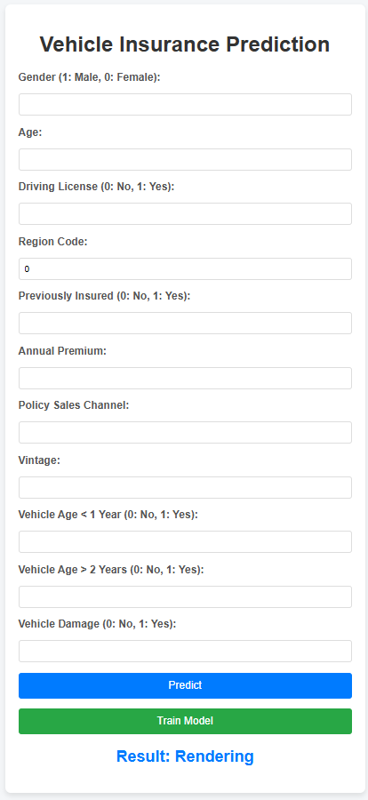

# MLOps Project on Vehicle Insurance Pipeline
This project is designed to demonstrate a robust end-to-end pipeline for managing vehicle insurance data. It showcases how real-world machine learning projects are structured, from data processing to model deployment, with a focus on automation and scalability.

- The project leverages the following technologies and services:

- Programming & ML: Python, Machine Learning (Random Forest Classification)

- Database: MongoDB for storing and managing data

- Containerization & Deployment: Docker, AWS EC2

- CI/CD Automation: Git, GitHub Actions

- Cloud Services: AWS IAM for access management, AWS S3 for storage, AWS ECR for container registry

Follow along to explore project setup, data processing, model deployment, and CI/CD automation, all designed to give recruiters and visitors a clear view of your ability to handle production-ready ML pipelines.

## 📁 Project Setup and Structure
### Step 1:

- To create the required folder structure and palceholder, run the blow command on the terminal
  ```base
  $python template.py
  ```
### Step 2: Virtual Environment and Dependencies
- To manage the setup of importing local modules or packages, `setup.py` and `pyproject.toml` files have been configured.
- Creating virtual environment and requirements installation:
  ```
  conda create -n vehicle python=3.12 -y
  conda activate mlops
  pip install -r requirements.txt
  ```
- To verify if all the packages are installed properly
  ```
  pip list
  ```

-----------------------------------------------------------
## 📊 MongoDB Setup and Data Management

### Step 3:
1. Sign up for [MongoDB Atlas](https://www.mongodb.com/cloud/atlas) and create a new project.
2. Set up a free M0 cluster, configure the username and password, and allow access from any IP address (`0.0.0.0/0`).
3. Retrieve the MongoDB connection string for Python and save it (replace `<password>` with your password).

### Step 4: Pushing Data to MongoDB
1. Create a folder named `notebook`, add the dataset, and create a notebook file `mongoDB_demo.ipynb`.
2. Use the notebook to push data to the MongoDB database.
3. Verify the data in MongoDB Atlas under Database > Browse Collections.

## 📝 Logging, Exception Handling
### Step 5: Set Up Logging and Exception Handling
- Create logging and exception handling modules. Test them on a demo file `demo.py`.

-----------------------------------------------------------
## 📥 Data Ingestion

### Step 6: Data Ingestion Pipeline
- Define MongoDB connection functions in `configuration.mongo_db_connections.py`.
- Develop data ingestion components in the `data_access` and `components.data_ingestion.py` files to fetch and transform data.
- Update `entity/config_entity.py` and `entity/artifact_entity.py` with relevant ingestion configurations.
- Run `demo.py` after setting up MongoDB connection as an environment variable.

### Setting Environment Variables
- Set MongoDB URL:
  ```bash
  # For Bash
  export MONGODB_URL="mongodb+srv://<username>:<password>...."
  # For Powershell
  $env:MONGODB_URL = "mongodb+srv://<username>:<password>...."
  ```
- **Note**: On Windows, may set environment variables through the system settings.

## 🔍 Data Validation, Transformation & Model Training

### Step 7: Data Validation
- Define schema in `config.schema.yaml` and implement data validation functions in `utils.main_utils.py`.

### Step 8: Data Transformation
- Implement data transformation logic in `components.data_transformation.py` and create `estimator.py` in the `entity` folder.

### Step 9: Model Training
- Define and implement model training steps in `components.model_trainer.py` using code from `estimator.py`.

-----------------------------------------------------------
## 🌐 AWS Setup for Model Evaluation & Deployment

### Step 9: AWS Setup
1. Log in to the AWS console, create an IAM user, and grant `AdministratorAccess`.
2. Set AWS credentials as environment variables.
   ```bash
   # For Bash
   export AWS_ACCESS_KEY_ID="YOUR_AWS_ACCESS_KEY_ID"
   export AWS_SECRET_ACCESS_KEY="YOUR_AWS_SECRET_ACCESS_KEY"
   ```

3. Configure S3 Bucket and add access keys in `constants.__init__.py`.

### Step 10: Model Evaluation and Pushing to S3
- Create an S3 bucket named `my-model-mlopsproj` in the `us-east-1` region.
- Develop code to push/pull models to/from the S3 bucket in `src.aws_storage` and `entity/s3_estimator.py`.

-----------------------------------------------------------


## 🚀 Model Evaluation, Model Pusher, and Prediction Pipeline

### Step 14: Model Evaluation & Model Pusher
- Implement model evaluation and deployment components.
- Create `Prediction Pipeline` and set up `app.py` for API integration.

### Step 15: Static and Template Directory
- Add `static` and `template` directories for web UI.

-----------------------------------------------------------

## 🔄 CI/CD Setup with Docker, GitHub Actions, and AWS

### Step 16: Docker and GitHub Actions
1. Create `Dockerfile` and `.dockerignore`.
2. Set up GitHub Actions with AWS authentication by creating secrets in GitHub for:
   - `AWS_ACCESS_KEY_ID`
   - `AWS_SECRET_ACCESS_KEY`
   - `AWS_DEFAULT_REGION`
   - `ECR_REPO`
   - `MONGODB_URL` `(optional)`

### Step 17: AWS EC2 and ECR
1. Set up an EC2 instance for deployment.
2. Install Docker on the EC2 machine.
3. Connect EC2 as a self-hosted runner on GitHub.

### Step 18: Final Steps
1. Open the 5000 port on the EC2 instance.
2. Access the deployed app by visiting `http://<public_ip>:5080`.

-----------------------------------------------------------

## 🛠️ Additional Resources
- **GitHub Secrets**: Manage secrets for secure CI/CD pipelines.

-----------------------------------------------------------

## 🎯 Project Workflow Summary

1. **Data Ingestion** ➔ **Data Validation** ➔ **Data Transformation**
2. **Model Training** ➔ **Model Evaluation** ➔ **Model Deployment**
3. **CI/CD Automation** with GitHub Actions, Docker, AWS EC2, and ECR

-----------------------------------------------------------

## 💬 Connect
If you found this project helpful or have any questions, feel free to reach out!

-----------------------------------------------------------

## Final Outcome:




